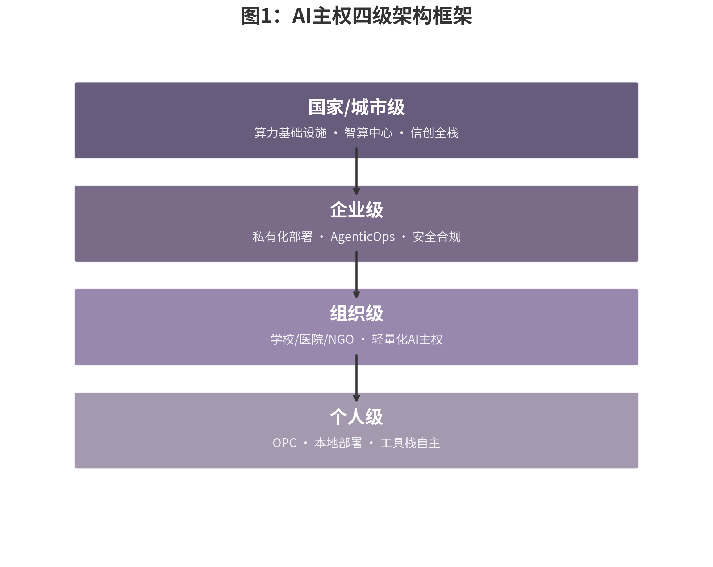

## 1.3 数字主权的全球实践

如果说主权意识的觉醒始于风险感知，那么2025至2026年的全球政策实践则将这种意识转化为制度性的行动。从华盛顿到布鲁塞尔，从北京到首尔，再到新加坡和迪拜，AI主权已经从学术讨论和智库报告进入了国家法律的实质层面。理解这一全球图景的关键，在于识别三个相互叠加的治理维度：规则层（立法与标准）、资本层（投资审查与产业基金）、以及基础设施层（算力、电力与数据）。任何国家若在两层以上缺失，都将被排除在AI主权竞赛之外。

### 美国：从数据治理框架到COINS法案的AI投资审查升级

美国的AI主权战略在2025至2026年经历了从"数据治理框架"到"投资审查升级"的关键转向。2025年12月18日，时任总统特朗普签署《全面对外投资国家安全法》（COINS Act），将拜登政府时期通过行政命令建立的"反向CFIUS"（Reverse CFIUS）机制永久化并大幅扩张[^ch01-6]。该法案新增俄罗斯、伊朗、朝鲜、古巴、委内瑞拉为"关切国家"，并将高性能计算和超算纳入受控技术类别。COINS Act设有七年日落条款，授权财政部在450天内（最迟2027年3月）颁布新实施细则。这意味着美国对华技术投资管制从临时性的行政措施升格为制度化的法律框架，其影响远超单一政策层面——它不仅限制了美国资本流向中国AI企业，更通过"长臂管辖"效应迫使全球投资机构重新评估对华AI投资的合规风险。

值得注意的是，COINS Act的行政资源投入反映了美国将出境投资审查提升至与入境审查同等优先级的战略判断。该法案授权财政部在2026和2027财年各获得1.5亿美元（合计3亿美元）用于出境投资审查，而传统的CFIUS（入境审查）2025财年预算仅约4500万美元[^ch01-6]。出境审查预算接近入境审查的七倍，这一比例本身就是美国国家安全优先级转变的量化表达。与此同时，美国各州也在加速立法：科罗拉多州AI法案（Colorado AI Act）要求高风险AI系统开发者披露训练数据，得克萨斯州HB 140法案禁止社交评分并要求生物识别同意。联邦与州层面的双线并进，反映了美国AI治理"碎片化但深度化"的特征。

### 欧盟：从数据本地化到技术可控

欧盟的AI主权路径则以《人工智能法》（AI Act）为核心支柱。2024年8月1日生效的AI Act原定于2026年8月2日全面适用高风险AI系统义务，但在2026年5月7日的Omnibus VII临时协议中，这一时间表被显著调整：Annex III（涵盖招聘、信用评分、执法等高风险场景）推迟至2027年12月2日，Annex I（医疗器械、机动车等）推迟至2028年8月2日[^ch01-7]。这一推迟是欧盟在竞争力压力下的重大妥协，但禁止性AI实践（如社会评分、实时远程生物识别）已于2025年2月生效，通用AI模型（GPAI）的义务也于2025年8月生效。

截至2026年3月，27个欧盟成员国中仅8个指定了单一联络点（Single Point of Contact），执法准备明显滞后[^ch01-7]。欧洲数据保护监管局（EDPS）于2026年3月17日发布《AI Act下新角色指南针（2026-2027）》，明确其作为欧盟机构AI系统市场监督机构（MSA）和特定高风险AI系统通知机构的职责。AI Office对GPAI模型进行主动监控，2026年重点聚焦系统性风险缓解、行为准则定稿和下游合规责任厘清。值得注意的是，欧盟的数字主权框架不仅限于AI Act，还包括《数字运营韧性法》（DORA）和《网络与信息系统指令》（NIS2），这些法规的核心诉求已从早期的"数据储存在哪里"深化为"谁最终控制数据"[^ch01-8]。这种从数据本地化到技术可控性的转变，标志着欧盟数字主权战略进入了2.0阶段。与此同时，欧盟Chips Act 2.0于2026年5月27日提出，预计投入300至600亿欧元公共资金，撬动3000亿欧元总投资，重点弥补先进制程制造缺口，并配套推出《云与人工智能发展法案》（Cloud and AI Development Act），要求成员国进行"主权风险评估"，确定对非欧盟公司技术的依赖程度。

### 中国：算电协同、投资审查与AI治理

中国的AI主权实践在2026年呈现出"制度密集化"与"基础设施战略化"并行的特征。2026年4月2日，十部门发布《人工智能科技伦理审查与服务办法（试行）》；4月10日，五部门发布《人工智能拟人化互动服务管理暂行办法》——这是全球首部针对AI拟人化互动服务的专项法规，适用于"模拟自然人人格特征、思维模式和沟通风格的持续性情感互动服务"[^ch01-9]；5月，国务院办公厅将AI综合性立法纳入2026年度立法计划。在对外投资维度，2026年6月1日公布的《国务院关于对外投资的规定》将于7月1日施行，首次以行政法规形式建立境外投资国家安全审查制度，对影响或可能影响国家安全的境外投资进行审查，违规最高处投资额千分之十的罚款并可责令停止投资[^ch01-10]。这一规定明确禁止通过跨境派遣技术人员、远程技术指导或跨境培训等方式规避技术出口管制——被业界称为对"新加坡洗白"等规避手法的精准封堵。

更具战略意义的是，2026年政府工作报告首次将"算电协同"（计算能力与电力系统协同规划）写入国家级新基建工程，意味着AI基础设施规划从"以算定电"转向"以电定算、以算优电"[^ch01-11]。中国数据中心用电量2025年已达1960亿千瓦时，预计2030年超7000亿千瓦时、占全社会用电量5%以上。算电协同的深层逻辑是将西部地区的绿电优势转化为算力优势，进而转化为全球AI服务的定价权——Token出海成本可降至欧美市场的五分之一至二十分之一。

2026年4月27日，中国国家发改委外商投资安全审查工作机制办公室（安审办）正式作出决定，禁止美国科技巨头Meta以超过20亿美元收购中国AI智能体公司Manus（蝴蝶效应），要求当事人撤销交易并恢复原状。这是自2021年《外商投资安全审查办法》实施以来，首个被公开叫停的AI领域外资收购案[^ch01-12]。尽管Manus后期将总部迁至新加坡，交易在形式上表现为"境外主体间并购"，但中国监管部门依据"实质重于形式"原则行使了管辖权，认定Manus的核心算法、训练数据及研发团队均源自中国境内。"境内孵化→迁址出海→境外转卖"的"洗澡式出海"操作被监管认定为无效。Manus案不仅是一次具体的执法行动，更是中国从被动的投资接收方转变为主动安全审查方的标志性事件，与美国的COINS Act形成了制度镜像。

### 新兴力量：韩国AI Basic Act、越南国家AI战略、新加坡AI核心化、中东主权AI投资潮

新兴经济体在AI主权竞赛中并非被动跟随者，而是各自探索差异化路径。韩国《人工智能发展与信任基础法》（AI Basic Act）于2026年1月22日生效，成为全球第二个通过综合性AI法的国家。该法采用"促进+监管"双轨模式，定义"高影响AI"（High-Impact AI）概念，但将罚款条款推迟一年至2027年执行，为产业界留出适应窗口[^ch01-13]。越南AI Law于2026年3月1日生效，采用与欧盟AI Act对齐的风险四级分类框架，并批准2026至2027年国家AI发展基金，国家技术创新基金（NATIF）将至少40%预算分配给AI项目，优先通过代金券（Voucher）支持中小企业使用本土AI解决方案[^ch01-14]。日本则选择了"促进优先、不设罚则"的独特路径：2025年5月通过的《人工智能相关技术研究开发及应用推进法》以"使日本成为全球最易开发和使用AI的国家"为目标，但刻意不设罚则，依赖行政指导与企业自愿合规[^ch01-15]。

新加坡在2026年5月20日发布的国家AI战略2.0更新版中，将AI升级为国家战略核心，设立由总理亲自担任主席的国家AI理事会，推出四大国家AI任务（先进制造、金融服务、互联互通、医疗保健），并承诺通过AI影响计划支持1万家中小企业[^ch01-16]。新加坡的路径代表了"可控开放"（Controlled Openness）模式——在核心基础设施上保持主权控制，在应用层和资本层面保持开放合作。这种务实的第三条道路对于无法承担全栈自主的小国而言具有示范意义。

中东地区的主权AI投资潮则呈现出截然不同的规模与逻辑。沙特HUMAIN项目承诺约1000亿美元建设11个数据中心（总装机2.2GW），阿联酋Stargate UAE目标1GW（首批200MW于2026年投运），由G42、Oracle、NVIDIA、OpenAI等联合体运营。两国合计主权AI承诺超过2000亿美元，成为全球最大的地缘政治基础设施项目之一[^ch01-17]。这种以主权财富基金为引擎、以"中立AI枢纽"为定位的模式，既与美国科技巨头合作，也与中国企业保持联系，构成了资源型国家AI主权的典型路径。NVIDIA 2025年主权AI收入预计超200亿美元，较上一年翻倍，这本身就是主权AI投资潮的量化证明。

### 全球趋势表格：12个主要经济体的AI主权政策对比

*表1：全球主要经济体AI主权政策对比（2025-2026）*

| 国家/地区 | 核心法规 | 生效/实施时间 | 关键要求 | 主权特征 |
|:---|:---|:---|:---|:---|
| **美国** | COINS Act + 州级AI法案 | 联邦：2025.12签署；州级：2025-2026陆续生效 | 限制对关切国家的AI/半导体/量子/超算领域投资；州级要求披露训练数据、禁止社交评分 | 投资审查导向，从入境扩展到出境 |
| **欧盟** | EU AI Act + DORA + NIS2 + Chips Act 2.0 | 禁止条款2025.2；GPAI 2025.8；高风险推迟至2027-2028 | 风险四级分类；高风险系统需合规评估；罚款最高3500万欧元或全球营业额7%；芯片投资3000亿欧元 | 监管驱动型，从数据本地化到技术可控性 |
| **中国** | AI综合性立法（推进中）+ 对外投资规定 + 多项专项法规 | 2026年密集生效 | 生成合成内容强制标识；AI拟人化互动服务专项管理；对外投资国家安全审查；算电协同上升为国家战略 | 制度密集化，内外双向合规 |
| **韩国** | AI Basic Act | 2026.1.22生效；罚款条款推迟一年 | 定义"高影响AI"；需风险评估与人类监督；外国企业需指定国内代表 | 促进+监管双轨，宽限期设计 |
| **日本** | 人工智能相关技术研究开发及应用推进法 | 2025.9.1全面生效 | 设立AI战略中心；制定AI基本计划；无罚则，依赖行政指导 | 促进优先，不设罚则 |
| **新加坡** | National AI Strategy 2.0 | 2026.5.20发布更新 | 国家AI理事会（总理任主席）；四大国家AI任务；支持1万家中小企业 | 核心化战略，区域枢纽定位 |
| **越南** | AI Law | 2026.3.1生效 | 风险四级分类；国家AI委员会；强调数据主权；国家AI发展基金 | 对齐欧盟框架，发展中国家模板 |
| **印度** | India AI Governance Guidelines + Digital India Act（推进中） | 指南已发布；DIA预计2027年立法 | 七项治理原则；IndiaAI Mission（算力+数据集+应用）；强调本土AI模型 | 原则先行，基础设施导向 |
| **沙特/阿联酋** | HUMAIN（沙特）+ Stargate UAE（阿联酋） | 2025年宣布；2026年起陆续投运 | 主权AI基础设施：沙特1000亿美元/11数据中心；阿联酋约250亿美元/1GW | 主权财富基金驱动，中立枢纽策略 |
| **巴西** | PL 2338/2023 | 参议院已批准；预计一年过渡期 | 风险分级；禁止过度风险AI；国家AI系统登记 | 拉美立法竞赛领跑者 |
| **墨西哥** | 联邦AI伦理、主权与包容性发展法（草案） | 预计2026年批准 | 拟设国家AI委员会；高风险AI需授权；禁止操纵行为与无差别生物识别监控 | 伦理导向，主权与包容并重 |
| **英国** | 11亿英镑主权算力战略 + AI大陆计划 | 2025年宣布实施 | 政府投资建设国家级AI算力基础设施；聚焦科研与公共服务；5-7年数据中心容量增三倍 | 算力主权导向，务实投资 |
上表呈现出三条清晰的政策路径。第一条是"监管驱动型"，以欧盟和越南为代表，通过风险分级和合规评估建立系统性治理框架；第二条是"投资审查型"，以美国和中国为代表，通过双向投资安全审查控制技术资本的跨境流动；第三条是"基础设施型"，以中东国家和英国为代表，通过主权财富基金或政府预算直接建设AI算力基础设施。大多数国家实际上在这三条路径之间组合选择，而选择的组合方式决定了其AI主权的实现形态与成本结构。全球已有26个国家正在制定或已制定综合性AI法规，AI立法从"自愿指南"转向"强制法律"的过渡窗口正在关闭。
