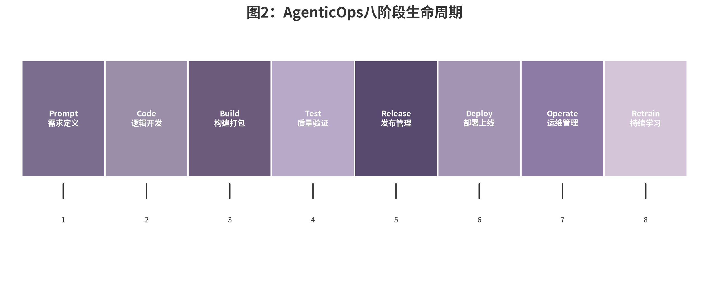

## 2.2 AgenticOps生命周期管理

> **【非技术读者速读】八阶段生命周期是什么？**
>
> 把AI智能体从"想法"到"持续进化"的全过程，分成八个阶段管理：
>
> **设计**（Prompt+Code）→ **构建**（Build+Test）→ **交付**（Release+Deploy）→ **运营**（Operate+Retrain）
>
> 就像造车：先画图纸→造零件→测试安全→量产上市→保养升级。每个阶段都有明确的质量门禁，确保AI不会在半路上失控。
>
> *各阶段详解见2.2.2-2.2.9节*

### 八阶段生命周期概览

2026年的产业实践已经收敛出一个相对统一的Agent生命周期模型。不同厂商的命名略有差异——OneReach.ai将其划分为Design/Build/Test/Deploy/Monitor/Improve/Retrain七个阶段[^ch02-14]，Alternates.ai则强调从设计到优化的闭环[^ch02-15]——但核心结构一致：Agent不是一次性的软件交付物，而是持续演化的活体系统。OpenCSG提出的八阶段模型（Prompt → Code → Build → Test → Release → Deploy → Operate → Retrain）因其与DevOps/MLOps流水线的兼容性，正在成为中文市场的主流参考框架[^ch02-8]。

以下用表格呈现八阶段生命周期各阶段的核心任务、质量门禁与反馈循环：

| 阶段 | 核心任务 | 质量门禁 | 反馈循环 |
|------|----------|----------|----------|
| **Prompt** | 需求定义、角色卡设计、权限边界 | 角色卡通过审批 | 运营数据 → 模型迭代 |
| **Code** | 逻辑开发、MCP集成、工具调用 | 权限边界已定义 | 运营数据 → 知识库更新 |
| **Build** | 智能体构建、依赖打包、环境配置 | 构建产物通过测试 | 同上 |
| **Test** | 质量验证、红队测试、性能基准 | 无灾难性输出 | 同上 |
| **Release** | 发布管理、版本控制、灰度策略 | 行为基线已建立 | 同上 |
| **Deploy** | 部署上线、灰度发布、监控接入 | 知识库已更新 | 同上 |
| **Operate** | 运维管理、日志审计、告警响应 | 幻觉率<5% | 同上 |
| **Retrain** | 持续学习、数据回流、模型更新 | 模型性能达标 | 数据回流至下一轮迭代 |

> 注：完整的八阶段生命周期结构图见第2章第2.2节（图2-1）。
这八个阶段可以映射到四个治理波段：

- **设计波段（Prompt + Code）**：定义Agent"应该做什么"和"能够做什么"。这是治理的源头——如果在这个阶段没有清晰界定行动边界，后续所有阶段都在为错误的前提买单。
- **构建波段（Build + Test）**：将设计转化为可运行的系统，并通过测试验证其边界行为。95%的生成式AI项目如果沿用传统测试方法将会失败[^ch02-15]，因为传统测试验证的是"正确输入产生正确输出"，而Agent测试需要验证"错误输入不会导致灾难性输出"。
- **交付波段（Release + Deploy）**：将经过测试的Agent安全地引入生产环境。这涉及模型卡片发布、安全报告、许可证合规、灰度策略和回滚机制。
- **运营波段（Operate + Retrain）**：监控Agent在生产环境中的表现，收集反馈数据，驱动模型迭代和知识库更新。这是AgenticOps区别于传统软件工程的独特阶段——Agent在运行过程中持续学习，其"版本"不是静态的。

### Prompt阶段：需求定义与智能体角色设计

Prompt阶段是AgenticOps中最被低估、也最容易出错的环节。企业常犯的错误是将Prompt视为"给模型的一段指令"，而非"Agent与外部世界交互的契约"。一个高质量的Prompt设计需要回答三个问题：这个Agent的角色定位是什么？它的行动边界在哪里？它如何处理边界之外的请求？

角色卡将Prompt从"自然语言指令"提升为"结构化契约"。其核心结构包含六大维度：身份与目标（角色定位、核心目标、服务范围）、权限边界（允许/禁止操作、升级条件）、输入处理规范（接受格式、拒绝策略、歧义处理）、输出规范（响应格式、置信度标注、溯源要求）、安全与合规（数据敏感级别、审计级别、人类审核触发条件）、以及模型与工具配置（默认模型、回退模型、MCP工具清单、知识库版本）。在PwC的实践案例中，其部署的250余个AI Agent和12000余个自定义GPT均采用类似的角色卡模板，95%的美国员工参与AI技能培训，软件开发效率提升20%至50%[^ch02-16]。角色卡的标准化不仅提升了Agent行为的可预测性，也为后续的审计和合规提供了明确的参照基准。

### Code阶段：逻辑开发与工具链选择

Code阶段的核心任务是将角色卡转化为可执行的Agent系统。这涉及三个关键技术决策：选择哪种Agent开发框架？如何与外部工具对接？如何处理多Agent协作？

在框架层面，2026年的市场呈现"一超多强"格局：LangGraph凭借其与LangChain生态的深度整合，在企业编排层占据领先位置；AutoGen（Microsoft Research）在Multi-Agent协作研究社区保持活跃；OpenCSG的CSGShip则主打国产替代和全链路管理[^ch02-8]。框架选择的关键标准不是功能丰富度，而是与现有DevOps/MLOps基础设施的兼容性——Agent流水线应当能够嵌入到企业已有的CI/CD体系中。

在工具对接层面，MCP已成为事实标准。一个典型的MCP Server设计包含四个核心要素：输入参数定义（使用Pydantic模型确保类型安全并自动生成JSON Schema）、工具描述（docstring是Agent选择工具的唯一依据，必须清晰、准确、包含前置条件）、输出结构化（返回结构化数据而非自然语言，便于下游Agent解析）、以及审计追踪（显式声明数据来源和时间戳）。以下以天气查询服务为例说明MCP Server的设计逻辑：

| 设计要素 | 实现方式 | 关键约束 | 目的 |
|----------|----------|----------|------|
| **输入参数** | Pydantic模型定义`city`和`units`字段 | 类型校验、必填项校验、默认值设置 | 防止Agent传入无效参数 |
| **工具描述** | 详尽的docstring，包含前置条件 | 必须说明调用前提、返回值结构、异常处理 | Agent据此选择何时调用该工具 |
| **输出结构** | 返回包含`city`/`temperature`/`humidity`/`condition`/`source`/`timestamp`的JSON | 固定字段名、标准化数据类型 | 下游Agent可直接解析，无需二次处理 |
| **审计追踪** | 输出中包含`source`和`timestamp` | 数据来源不可伪造、时间精确到秒 | 为合规审计和故障排查提供依据 |
在多Agent协作层面，A2A（Agent-to-Agent Protocol）提供了跨平台Agent协作的标准通信机制。A2A v1.0于2026年1月正式发布，引入了签名Agent Cards和信任机制，50余个AAIF工作组成员组织已部署[^ch02-17]。A2A的核心概念是"Agent Card"——一个JSON-LD描述的Agent能力档案，包含该Agent支持的任务类型、输入输出格式、端点地址和认证要求。当编排层需要将一个任务分配给合适的Agent时，它首先查询候选Agent的Card，然后根据匹配度和当前负载做出路由决策。

### Build阶段：智能体构建与打包

Build阶段将Code阶段的产物转化为可部署的单元，涉及容器化、依赖管理、版本锁定和配置分离四项实践。

容器化是Agent部署的基础。Docker AI Toolkit 2026版本默认启用了设备级身份认证、运行时策略强制（eBPF驱动的细粒度网络微隔离）及模型权重签名验证，所有AI容器启动前必须通过可信执行环境（TEE）完整性校验[^ch02-18]。这意味着Agent的构建流程不再是简单的`docker build`，而是需要在CI流水线中嵌入安全扫描步骤：模型权重哈希校验、MCP Server依赖漏洞扫描、Prompt注入检测。

依赖管理在AgenticOps中尤为复杂。一个典型的企业Agent可能依赖：特定版本的PyTorch/TensorFlow（用于模型推理）、特定版本的MCP SDK（用于工具连接）、特定版本的向量数据库客户端（用于RAG检索）、以及外部API的OpenAPI规范。任何一个依赖的版本漂移都可能导致行为变化。因此，AgenticOps要求"全依赖锁定"——不仅Python包要锁定（`poetry.lock`或`uv.lock`），模型权重文件、MCP Server二进制、甚至外部API的OpenAPI Schema版本都必须纳入版本管理。

版本锁定的实践可以参考以下结构：Agent打包目录包含`agent/`（核心逻辑）、`prompts/v1.2.0/`和`prompts/v1.3.0/`（Prompt版本隔离）、`mcp-servers/`（MCP Server版本锁定）、`models/`（模型权重与哈希校验）、`knowledge/`（知识库快照）、`agent.lock`（全依赖锁定文件）以及`agent.yaml`（部署描述符，记录模型版本、Prompt版本和工具清单）。这种打包方式确保了一个关键属性：给定相同的`agent.yaml`和`agent.lock`，任何环境构建出的Agent都应当产生一致的行为。这是AgenticOps"可复现性"原则的技术基础。

### Test阶段：质量验证

Agent的测试策略与传统软件测试存在本质差异。传统测试验证的是"已知输入产生已知输出"，而Agent测试需要验证的是"未知输入不产生灾难性输出"。这要求测试体系覆盖四个层面：

**单元测试（Unit Testing）**针对Agent的确定性组件——工具调用函数、数据解析逻辑、状态转换规则。这些组件可以用传统的pytest/Jest测试覆盖，因为它们的行为是可预测的。

**红队测试（Red Teaming）**是Agent测试的独特环节。2026年，AI红队测试已从实验性安全实践转变为强制性合规要求。欧盟AI Act要求所有高风险AI系统在上市前进行对抗性测试，违规罚款最高达3500万欧元或全球年营业额7%（以较高者为准）[^ch02-19]。自主红队Agent（Agentic Red Teaming）的出现将传统人工渗透测试成本从每次15,000至50,000美元压缩至28.50美元，Carnegie Mellon基准测试显示156倍的成本降低[^ch02-20]。但人类验证仍然是发现高影响漏洞的关键，"混合模式"（AI深度扫描+人类验证）正在成为最佳实践。

红队测试的典型场景包括：Prompt注入（尝试通过恶意输入覆盖系统指令）、角色越狱（诱导Agent突破角色卡定义的行为边界）、工具劫持（通过篡改工具描述或伪造工具响应操纵Agent行为）、以及拒绝服务（通过海量边缘请求耗尽资源）。

**幻觉检测（Hallucination Detection）**对于知识密集型Agent至关重要。全球因AI幻觉导致的商业损失在2024年已达674亿美元，47%的企业高管曾因幻觉信息做出重大决策失误[^ch02-21]。企业级幻觉治理已形成"RAG + 输出护栏 + 可观测性 + 知识中台"的四层架构。其中，高质量知识中台可将垂直场景下的AI幻觉率从30%以上降至5%以内[^ch02-22]。

**基准评估（Benchmark Evaluation）**使用标准化的任务集衡量Agent在特定领域的能力。对于代码Agent，SWE-Bench和LiveCodeBench是行业标准；对于通用推理Agent，MMLU-Pro和GPQA Diamond提供跨模型可比性；对于企业垂直场景，通常需要构建内部Golden Dataset（黄金数据集），包含历史真实案例及其标准处理流程。

### Release阶段：发布管理

Release阶段将经过测试的Agent引入预发布环境，准备正式上线。这个阶段的核心交付物包括：模型卡片（Model Card）、安全评估报告、许可证合规声明和部署清单。

模型卡片起源于Google的ML实践，在AgenticOps中扩展为"Agent Card"——不仅包含模型信息，还包含角色卡版本、工具清单、权限矩阵、已知限制和失效模式。Agent Card应当被视为Agent的"说明书"和"免责条款"的结合体：它告知用户这个Agent能做什么、不能做什么、在什么情况下需要人类介入。

安全评估报告应涵盖红队测试结果、漏洞修复记录、隐私影响评估和合规审查结论。对于高风险Agent（如能够访问财务系统或客户数据库的Agent），安全评估报告可能需要由独立第三方审计机构出具。

许可证合规在开源模型时代尤为复杂。企业使用Qwen3（Apache 2.0）或DeepSeek V4（MIT）时，商用自由度较高，但需保留版权声明；使用Llama 4时则需遵守Meta的社区许可，包括700M月活用户上限和欧盟多模态禁用条款[^ch02-23]。当Agent的依赖链包含多种许可证时，企业法务需要审查许可证兼容性——Apache 2.0与MIT可以共存，但GPL 3.0的传染性条款可能影响商业闭源组件的合法性。

### Deploy阶段：部署上线

Deploy阶段的核心挑战是"如何在保证安全的前提下最大化上线速度"。2026年的企业实践已形成三种部署策略的混合使用：本地部署（On-premise）处理敏感数据、边缘部署（Edge）满足低延迟需求、云端部署（Cloud）提供弹性扩展能力。

本地部署在企业AI基础设施中的占比已从2023年的12%跃升至2025年的55%，On-premise segment占2026年LLM市场约60%份额[^ch02-24]。驱动这一转变的核心因素包括：数据安全（敏感数据不出内部网络）、合规要求（金融、医疗、政府、国防的强制数据本地化）、延迟控制（本地推理将响应时间从1.5秒降至40毫秒以下）和成本优化（本地执行每百万token成本比高端云API低18倍）[^ch02-24]。

灰度发布（Canary Deployment）是Agent上线的标准策略。与软件灰度不同，Agent灰度需要额外的安全观测指标：不仅关注系统错误率，还要监控异常行为率——如工具调用频率突变、响应模式偏离基线、权限边界被频繁触及。这些指标可能预示着Agent在遭遇Prompt注入或环境变化。

回滚机制（Rollback）在AgenticOps中更为复杂。传统软件回滚只需替换二进制即可，Agent回滚可能涉及模型权重、Prompt版本、知识库状态和工具依赖的多版本协同。因此，Agent部署系统需要维护完整的"部署快照"——包含Agent的所有版本化依赖，以便在必要时整体回滚到上一稳定状态。

### Operate阶段：运维管理

Operate阶段是Agent进入生产环境后的持续治理。传统运维监控的是"系统健康指标"（CPU、内存、延迟、错误率），AgenticOps运维监控的是"行为健康指标"——任务成功率、工具调用成功率、每任务成本、幻觉率、人类介入率和策略合规率。

Gartner预测，到2028年50%的企业生成式AI部署将采用正式的可观测性投资（目前仅15%）[^ch02-25]。Agent可观测性需要记录完整的决策链路：用户输入 → Agent推理过程 → 工具选择依据 → 工具调用参数 → 工具响应 → 最终输出 → 人类反馈（如有）。这个链路构成了Agent的"审计轨迹"（Audit Trail），是合规审查和故障排查的基础。

2026年，AI审计追踪已从"最佳实践"转变为"监管要求"。COSO在2026年2月发布《生成式AI与内部控制》新指引，要求有效监控AI驱动流程的完整审计追踪；EU AI Act Article 12要求高风险AI系统部署者保留至少6个月日志[^ch02-26]。AI审计追踪的最低标准包含12个字段：时间戳、唯一决策ID、已认证人类用户身份、AI系统身份与版本、模型身份与版本、接收输入、调用的策略/规则/提示、人类可读语言的推理过程、生成的输出、下游系统采取的行动、人工审查或批准记录、以及防篡改完整性证明[^ch02-26]。

成本追踪是Operate阶段容易被忽视但至关重要的环节。一个基于GPT-4级云API的Agent，如果每天处理1000个复杂任务，年度Token成本可能达到数十万美元。通过本地部署Qwen3或DeepSeek V4，企业可以将推理成本降低90%以上。但成本优化不能以牺牲可观测性为代价——许多企业为了节省日志存储费用而减少审计记录的粒度，这在监管审查时可能成为致命的合规缺口。

### Retrain阶段：持续学习

Retrain阶段是AgenticOps区别于传统软件工程的标志性环节。Agent在生产环境中不断接触新的数据、新的用户请求和新的工具响应，这些反馈数据是模型迭代和知识库更新的宝贵原料。但"持续学习"也是一把双刃剑——如果学习机制设计不当，Agent可能从错误反馈中习得有害行为，或被恶意投毒数据污染。

数据回流（Data Feedback Loop）需要经过严格的质量控制。企业实践中通常采用"三层过滤"机制：第一层自动过滤明显的垃圾数据（如空输入、乱码、测试请求）；第二层由轻量级模型或规则引擎进行语义质量评分；第三层由人类审核员抽检高风险样本。只有通过了全部三层过滤的数据才能进入训练或微调数据集。

微调策略（Fine-tuning Strategy）在2026年已呈现多样化。全量微调（Full Fine-tuning）虽然效果最佳，但计算成本高昂；LoRA（Low-Rank Adaptation）和QLoRA等参数高效微调方法可以在消费级GPU上实现领域适配；DPO（Direct Preference Optimization）和GRPO（Group Relative Policy Optimization）等对齐方法被用于安全行为的强化学习[^ch02-27]。企业通常采用"基础模型季度更新 + 领域适配月度微调 + 安全策略实时调整"的阶梯式策略。

模型迭代（Model Iteration）需要与Agent Card的版本管理协同。当底层模型从Qwen3-235B-A22B v1.2升级至v1.3时，Agent的Prompt可能需要相应调整——因为新模型的语义理解和工具调用行为可能发生变化。这种"模型-Prompt"协同版本管理是AgenticOps的精细操作，实践中常通过A/B测试来验证新模型版本的行为一致性。

知识库更新（Knowledge Base Update）对于RAG驱动的Agent尤为重要。企业知识库通常以周或月为单位更新，更新前需要经过与代码部署类似的测试流程：构建测试查询集、验证检索准确性、检查幻觉率变化、确认无敏感信息泄露。2026年的新威胁——RAG投毒（PoisonedRAG）——使得知识库更新流程中必须嵌入安全扫描。PoisonedEye攻击表明，攻击者仅需在知识库中植入单个精心设计的图片-文本对，即可100%诱导视觉-语言RAG系统生成虚假信息[^ch02-28]。PR-Attack通过在知识库注入少量投毒文本并嵌入后门触发词，攻击成功率超过90%，隐蔽性达95%以上[^ch02-29]。
