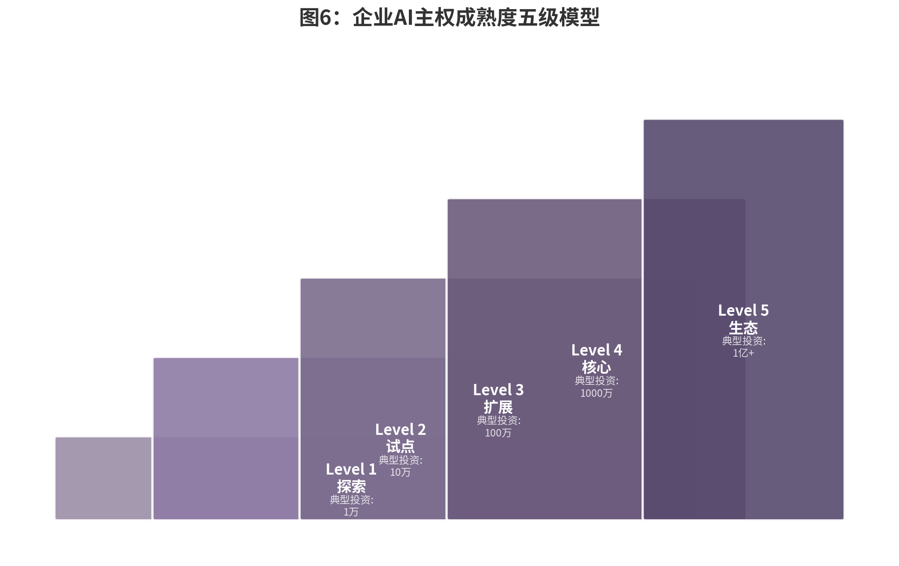

## 5.1 企业级AI主权的特殊挑战

### 从个体到企业的复杂度跃迁：规模、合规、集成、治理的四维挑战

当AI主权从个人层级延伸到企业层级，其挑战不是简单的"放大版"，而是发生了质的结构性变化。个人用户可以凭借一台AI PC和Ollama的本地模型就实现数据不出域的AI主权，但企业面对的却是一个由数千名员工、数百套系统、数十个业务部门构成的复杂生态。2026年的企业级AI部署，需要同时跨越四个维度的复杂度门槛。

**规模维度**首先带来数据与算力的非线性需求。个人用户可能只需处理数百份文档的知识库，而一家中型券商的内部文档量动辄数十万份，包含监管申报、客户协议、投研报告、合规手册等异构数据。将这些数据注入AI系统，不仅需要向量数据库的分布式扩展，还需要解决数据清洗、版本控制、权限分层和实时同步问题。在算力端，中国信通院2025年的报告给出了一个关键阈值：当企业并发用户数超过500、日均查询量超过5万次时，私有化部署的总拥有成本（TCO）才开始比SaaS模式显现出18%至31%的优势[^ch05-7]。这意味着低于该阈值的企业，必须在成本与主权之间做出更艰难的权衡。

**合规维度**是企业在个人层级几乎不会面对的硬约束。2026年1月1日，新修订的《网络安全法》正式施行，首次在国家基础法律层面确立AI发展的战略地位，引入千万元级罚单与个人责任穿透机制[^ch05-8]。2026年6月1日，《商业秘密保护规定》将"数据"与"算法"明确纳入商业秘密保护范畴[^ch05-8]。在金融行业，算法备案与大模型备案制度已进入深水区——截至2026年2月底，全国累计796款生成式AI服务完成大模型备案，481款应用完成登记，且地方补贴政策密集出台（北京经开区对首次获得国家大模型备案的企业给予100万元一次性奖励）[^ch05-9]。对于跨国企业，数据出境负面清单制度已从自贸区扩展至北京全市、上海全市与广东自贸区，覆盖612个数据字段，跨境合规的复杂度呈指数级上升[^ch05-10]。

**集成维度**考验企业现有IT架构与AI系统的兼容性。大多数企业的核心业务系统——ERP、CRM、SCM、HIS、核心银行系统——构建于十年前甚至二十年前，其数据接口、身份认证体系和事务处理逻辑与Agent的异步、语义化、概率性特征存在根本性张力。2026年，Docker AI Toolkit的发布试图弥合这一鸿沟，通过设备级身份认证、运行时策略强制（eBPF驱动的细粒度网络微隔离）及模型权重签名验证，使所有AI容器启动前必须通过可信执行环境（TEE）完整性校验[^ch05-11]。但现实中的企业集成远比工具链复杂：一家省级电信运营商需要将其Agent系统同时对接NMC（网络管理中心）、PM（性能管理）、FM（故障管理）、RM（资源管理）等六个核心系统，覆盖全省21个地市、800余个接入节点，任何单点的接口变更都可能引发连锁故障[^ch05-12]。

**治理维度**是企业级AI主权区别于个人实践的核心差异。个人用户只需对自己负责，企业则需要建立覆盖数据分类、权限管控、模型审计、幻觉监控、成本追踪和应急响应的完整治理体系。2026年，COSO发布《生成式AI与内部控制》新指引，要求有效监控AI驱动流程的完整审计追踪；SEC宣布成立专门的SOX执法小组；欧盟AI Act则要求高风险AI系统部署者保留至少六个月日志[^ch05-13]。这些外部监管要求，叠加企业内部的RACI（Responsible, Accountable, Consulted, Informed）矩阵，构成了AI治理的多层网络。而现实数据令人警醒：仅20%的企业拥有成熟的AI治理模型，80%的组织已经历过危险的AI Agent行为（包括未授权数据暴露）[^ch05-14]。

### 多部门协作与权限管理：零信任架构与AI融合的企业级权限设计

在企业环境中，AI Agent不是孤立运行的工具，而是嵌入到组织权力结构与协作流程中的行动体。一个财务部门的Agent可能需要访问报销系统但绝不能触碰薪酬数据；一个市场部门的Agent可以调用设计工具但无权审批预算；一个客服Agent可以查询客户订单但不应看到客户的信用评分。这些权限边界不是技术问题，而是组织治理问题在数字空间的映射。

2026年，零信任架构（Zero Trust Architecture）已成为企业AI安全的核心防线。Gartner与IDC预测，到2027年超过70%的企业将采用SASE（Secure Access Service Edge）架构支持远程办公和分支机构的安全需求[^ch05-15]。零信任在AI环境中的核心演进，是从"信任网络边界"转向"不信任任何人、任何设备、任何请求"——即便请求来自内部AI Agent。Docker AI Toolkit 2026的默认配置体现了这一理念：所有AI容器启动前必须通过TEE完整性校验，运行时策略由eBPF驱动的细粒度网络微隔离强制执行，模型权重须经过签名验证[^ch05-11]。

MCP（Model Context Protocol，模型上下文协议）在企业权限管理中的演进，是2026年最值得关注的技术治理趋势之一。MCP在2025年3月的规范更新中正式支持OAuth 2.1授权机制，引入PKCE（Proof Key for Code Exchange）强制要求、动态客户端注册（DCR）和授权服务器元数据发现[^ch05-16]。在最新草案中，MCP Server的角色从"授权服务器"转变为"资源服务器"，授权功能由专门的身份提供商负责，通过Protected Resource Metadata协议（RFC 9728）实现授权服务器发现[^ch05-16]。这一演进意味着企业可以将现有的身份认证基础设施（如Active Directory、LDAP、SSO）与AI Agent的权限体系打通，实现统一的访问控制策略。

然而，实践中的挑战依然严峻。Astrix Security对5200余个开源MCP服务器的分析显示，53%依赖不安全的静态密钥而非OAuth，这意味着企业如果直接采用未经安全加固的开源MCP服务器，将面临严重的凭证泄露风险[^ch05-17]。2025年至2026年间已发生多起MCP Server安全事件，包括弱密码认证被暴力破解、未实施多因素认证导致钓鱼攻击、以及认证机制设计缺陷被绕过[^ch05-18]。MCP Inspector更曾曝出一个高危漏洞（CVE-2025-49596），未授权访问可导致任意命令执行[^ch05-18]。

企业级AI权限管理的最佳实践正在快速收敛。第一，**最小权限原则**（Principle of Least Privilege）要求AI Agent仅被授予完成特定任务所需的最小权限，禁止以root或sudo权限运行Agent[^ch05-19]。第二，**动态权限管控**基于RBAC（Role-Based Access Control）模型支持16维度访问控制，包括设备指纹、地理位置、时间窗口等零信任要素，并自动回收三个月未使用的访问权限[^ch05-20]。第三，**短期凭证与自动轮换**要求服务账户使用短期凭证，自动化轮换，默认最小权限[^ch05-15]。这些原则的共同指向是：将AI Agent视为"数字员工"进行权限管理，而非将其视为可信的软件组件。

### 合规审计与安全隔离：数据分类、网络隔离、访问审计的完整矩阵

企业级AI主权的合规审计体系，可以视为一个三维矩阵：数据分类决定什么可以被AI处理，网络隔离决定AI可以访问什么，访问审计决定谁对AI的行为负责。这三个维度相互交织，构成了企业AI合规的完整边界。

**数据分类**是企业AI治理的起点。2026年的监管框架要求企业对数据实施分级管理。中国"三法"（《网络安全法》《数据安全法》《个人信息保护法》）及《网络数据安全管理条例》构成了AI数据治理的法律基座。在AI语境下，企业须对预训练数据与优化训练数据的来源合法性负责，确保个人信息处理具备合法基础（告知同意或单独同意）[^ch05-21]。关键信息基础设施运营者使用AI安全产品时，须确保决策可审计、可追溯[^ch05-21]。在政企市场（政务、金融、能源）中，80%以上要求AI模型与数据全部部署在自有环境（私有云/本地），混合云仅在数据敏感度较低的行业渗透[^ch05-22]。

**网络隔离**是技术层面的核心防线。企业级AI部署通常采用"内外分层、数据分区"的架构：核心生产数据与模型训练环境物理隔离，敏感业务系统通过API网关与AI Agent交互，所有跨域流量经过加密与审计。信创一体机（如华为昇腾一体机、雪浪MindCenter X100）的兴起，正是为了降低这一架构的部署门槛——将计算、存储、网络与AI软件栈预装于经过安全加固的硬件平台，开箱即用[^ch05-23]。对于高合规要求的场景，部分企业甚至采用"空气间隙"（Air Gap）策略：训练环境与互联网完全断开，模型权重通过物理介质传递，确保任何外部攻击都无法直接触达核心系统。

**访问审计**则将技术与治理缝合为可追溯的证据链。2026年，AI审计追踪已从"最佳实践"转变为"监管要求"。COSO、SEC与EU AI Act共同推动了一套最低标准：时间戳（NTP同步UTC）、唯一决策ID、已认证人类用户身份、AI系统身份与版本、模型身份与版本、接收输入（含来源归因）、策略/规则/提示的调用、人类可读语言的推理过程、生成的输出、下游系统采取的行动、人工审查或批准（含审查者身份）、以及防篡改完整性证明（加密哈希或等效机制）[^ch05-13]。这一12字段标准意味着，企业需要为每一次AI决策建立一个"数字档案"——不是可选的日志，而是可被监管调取、可被司法采信的证据。

常见的审计失效模式同样值得警惕。服务账户归因缺失（AI以API密钥访问受监管数据但无个人身份关联）、置信度评分代替推理过程、静默模型升级（未记录版本变更）、日志分散在多个系统、无防篡改证据、保留期限不匹配、无异常追踪——这些失效模式在2026年的合规检查中被反复发现[^ch05-13]。对于追求AI主权的企业而言，建立一套统一的审计基础设施，其优先级不应低于模型本身的精度优化。

### 大规模部署与资源调度：算力调度、模型路由、弹性伸缩

当AI Agent从试点走向规模化，资源调度成为企业IT基础设施的新战场。一家部署了20个以上AI Agent的企业（2026年营收超50亿美元的头部企业，Agent部署数量中位数已达23个）[^ch05-24]，需要同时处理不同模型的推理请求、向量数据库的检索负载、RAG（Retrieval-Augmented Generation，检索增强生成）系统的文档索引更新，以及Multi-Agent协作时的任务编排开销。这些负载在时间上不均匀、在空间上分散、在优先级上动态变化，对资源调度提出了远超传统Web应用的要求。

**算力调度**的核心挑战在于异构计算环境的统一管理。2026年的企业数据中心通常同时存在多种计算资源：英伟达GPU用于高性能模型推理，华为昇腾910B用于信创合规场景，国产CPU（鲲鹏、飞腾、海光）用于通用计算与轻量推理，甚至部分边缘节点采用寒武纪思元或壁仞BR100进行本地推理[^ch05-25]。不同芯片的指令集、内存架构、驱动栈与软件生态各不相同，企业需要构建一个跨芯片的算力调度层，将上层AI应用与底层硬件解耦。这一调度层不仅需要在任务提交时进行芯片匹配，还需要在运行时监控利用率、温度与功耗，在故障时自动迁移任务。

**模型路由**是2026年企业级AI架构的新兴能力。不同任务对模型的需求差异巨大：简单的客户查询可由7B参数的轻量模型处理，复杂的合同分析需要70B以上的大模型，而涉及创意生成的任务可能需要多模态模型。企业级模型路由系统（如招商证券"招小聚"采用的"一超多强"架构——千亿级基础模型加多套百亿级垂域模型）[^ch05-26]根据任务类型、复杂度、延迟要求和成本预算，动态选择最合适的模型执行请求。这种路由不仅优化了成本（轻量模型的推理成本仅为大模型的1/50），还提升了整体吞吐量。更进一步，"将常规流量路由到量化小模型，每查询kWh降低60-80%"的实践，正在将模型路由与ESG（环境、社会和治理）目标挂钩[^ch05-27]。

**弹性伸缩**在AI场景中的特殊性在于，负载峰值往往不可预测。一家券商在财报季的客户查询量可能达到平日的五倍；一家电商企业在促销期间的订单处理Agent需要瞬间扩容。传统云计算的弹性伸缩基于CPU/内存阈值，而AI负载的瓶颈在于GPU显存与推理延迟。2026年的企业实践表明，"中心云+边缘节点"的混合部署架构，能够有效降低访问延迟、提高系统可用性，同时通过K8s（Kubernetes）容器编排实现Agent实例的自动扩缩容[^ch05-28]。对于私有化部署的企业，这意味着需要在本地预留足够的弹性容量，或通过混合云架构将溢出负载安全地路由到公有云。

### 持续运维与性能优化：幻觉率监控、延迟优化、成本追踪

AI系统的运维不是"部署后即忘"（deploy and forget），而是一个持续演化的生命周期。与传统软件不同，AI Agent的性能会在模型升级、数据漂移、工具API变更和用户使用模式演化的多重因素下发生静默退化。2026年，Gartner预测到2028年50%的企业生成式AI部署将采用正式的可观测性投资（目前仅15%）[^ch05-29]。这一数字背后，是企业对AI运维认知的根本转变：从"监控系统是否在线"到"治理模型行为质量"。

**幻觉率监控**是企业级AI运维的首要指标。斯坦福《AI Index 2026》报告指出，主流大模型在垂直领域的幻觉率高达22%至94%，不同场景间的差异极为悬殊[^ch05-30]。通用大模型的幻觉率通常在3%以上，而经过企业知识库增强的私有化部署可将事实性错误率压至0.5%以下[^ch05-31]。2026年最优模型的幻觉率已降至1.8%（antgroup/finix_s1_32b），但不同模型间的差异依然巨大[^ch05-32]。企业需要建立持续运行的幻觉检测流水线：对高频查询类型定期采样、使用黄金数据集（Golden Dataset）进行回归测试、监控用户反馈中的"纠错信号"、并对高幻觉率场景触发模型切换或人工审核流程。

**延迟优化**直接影响用户体验与业务连续性。在证券交易的智能投顾场景中，系统需要在0.8秒内返回匹配的投资组合方案；在电信网络运维中，故障预测Agent的响应延迟决定了修复窗口的大小。延迟优化涉及多个层次：模型层面的量化（INT4/INT8）与蒸馏（Distillation）可将推理时间压缩50%以上；基础设施层面的缓存策略（对高频查询的Embedding与检索结果进行缓存）可减少重复计算；网络层面的边缘节点部署将平均延迟降低30%至50%[^ch05-33]。

**成本追踪**是企业AI主权的经济底线。与SaaS模式的按Token计费不同，私有化部署的成本结构是固定的硬件折旧、电力消耗、人力运维和软件许可，但资源利用率的不透明常常导致隐性浪费。2026年的最佳实践要求企业建立"每任务成本"（Cost Per Task）的追踪体系：记录每个Agent每次任务调用的模型类型、Token消耗、GPU占用时间、向量检索次数和外部API调用费用，并将其归因到具体的业务部门与项目。这种精细化的成本追踪不仅优化了资源分配，还为AI投资的ROI计算提供了可信的数据基础。
